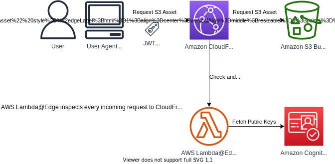

## CloudFront authorization@edge

This repo accompanies the [blog post](https://aws.amazon.com/blogs/networking-and-content-delivery/authorizationedge-using-cookies-protect-your-amazon-cloudfront-content-from-being-downloaded-by-unauthenticated-users/).

In that blog post a solution is explained, that puts **Cognito** authentication in front of (S3) downloads from **CloudFront**, using **Lambda@Edge**. **JWTs** are transferred using **cookies** to make authorization transparent to clients.

The sources in this repo implement that solution.

The purpose of this sample code is to demonstrate how Lambda@Edge can be used to implement authorization, with Cognito as identity provider (IDP). Please treat the code as an _**illustration**_––thoroughly review it and adapt it to your needs, if you want to use it for serious things.

### TL;DR



(More detailed diagrams and explanation in the [blog post](https://aws.amazon.com/blogs/networking-and-content-delivery/authorizationedge-using-cookies-protect-your-amazon-cloudfront-content-from-being-downloaded-by-unauthenticated-users/))

### How to deploy

The solution can be deployed to your AWS account with a few clicks, from the [Serverless Application Repository](https://console.aws.amazon.com/lambda/home#/create/app?applicationId=arn:aws:serverlessrepo:us-east-1:520945424137:applications/cloudfront-authorization-at-edge).

More deployment options below: [Deploying the solution](#deploying-the-solution)

### Alternative: use HTTP headers

This repo is the "sibling" of another repo here on aws-samples ([authorization-lambda-at-edge](https://github.com/aws-samples/authorization-lambda-at-edge)). The difference is that the solution in that repo uses http headers (not cookies) to transfer JWTs. While also a valid approach, the downside of it is that your Web App (SPA) needs to be altered to pass these headers, as browsers do not send these along automatically (which they do for cookies).

### Alternative: build an Auth@Edge solution yourself, using NPM library [cognito-at-edge](https://github.com/awslabs/cognito-at-edge)

The repo here contains a complete Auth@Edge solution, i.e. predefined Lambda@Edge code, combined with a CloudFormation template and various CloudFormation custom resources that enable one-click deployment. This CloudFormation template has various parameters, to support multiple use cases (e.g. bring your own User Pool or CloudFront distribution).

You may want to have full control and implement an Auth@Edge solution yourself. In that case, the NPM library [cognito-at-edge](https://github.com/awslabs/cognito-at-edge), may be of use to you. It implements the same functionalities as the solution here, but wrapped conveniently in an NPM package, that you can easily include in your Lambda@Edge functions.

## Repo contents

This repo contains (a.o.) the following files and directories:

Lambda@Edge functions in [src/lambda-edge](src/lambda-edge):

- [check-auth](src/lambda-edge/check-auth): Lambda@Edge function that checks each incoming request for valid JWTs in the request cookies
- [parse-auth](src/lambda-edge/parse-auth): Lambda@Edge function that handles the redirect from the Cognito hosted UI, after the user signed in
- [refresh-auth](src/lambda-edge/refresh-auth): Lambda@Edge function that handles JWT refresh requests
- [sign-out](src/lambda-edge/sign-out): Lambda@Edge function that handles sign-out
- [http-headers](src/lambda-edge/http-headers): Lambda@Edge function that sets HTTP security headers (as good practice)
- [rewrite-trailing-slash](src/lambda-edge/rewrite-trailing-slash): Lambda@Edge function that appends "index.html" to paths that end with a slash (optional use, intended for static site hosting, controlled via parameter `RewritePathWithTrailingSlashToIndex`, see below)
- [shared](src/lambda-edge/shared): Utility functions used by several Lambda@Edge functions

CloudFormation custom resources in [src/cfn-custom-resources](src/cfn-custom-resources):

- [us-east-1-lambda-stack](src/cfn-custom-resources/us-east-1-lambda-stack): Lambda function that implements a CloudFormation custom resource that makes sure the Lambda@Edge functions are deployed to us-east-1 (which is a CloudFront requirement, see below.)
- [react-app](src/cfn-custom-resources/react-app): A sample React app that is protected by the solution. It uses AWS Amplify Framework to read the JWTs from cookies. The directory also contains a Lambda function that implements a CloudFormation custom resource to build the React app and upload it to S3
- [static-site](src/cfn-custom-resources/static-site): A sample static site (see [SPA mode or Static Site mode?](#spa-mode-or-static-site-mode)) that is protected by the solution. The directory also contains a Lambda function that implements a CloudFormation custom resource to upload the static site to S3
- [user-pool-client](src/cfn-custom-resources/user-pool-client): Lambda function that implements a CloudFormation custom resource to update the User Pool client with OAuth config
- [user-pool-domain](src/cfn-custom-resources/user-pool-domain): Lambda function that implements a CloudFormation custom resource to lookup the User Pool's domain, at which the Hosted UI is available
- [lambda-code-update](src/cfn-custom-resources/lambda-code-update): Lambda function that implements a CloudFormation custom resource to inject configuration into the lambda@Edge functions and publish versions
- [generate-secret](src/cfn-custom-resources/generate-secret): Lambda function that implements a CloudFormation custom resource that generates a unique secret upon deploying

Other files and directories:

- [./example-serverless-app-reuse](./example-serverless-app-reuse): Contains example SAM templates and CDK code that shows how to reuse this application your own SAM or CDK templates.
- [./template.yaml](./template.yaml): The SAM template that comprises the solution
- [./webpack.config.js](./webpack.config.js): Webpack config for the Lambda@Edge functions
- [./tsconfig.json](./tsconfig.json): TypeScript configuration for this project

## Deploying the solution

### Option 1: Deploy through the Serverless Application Repository

The solution can be deployed with a few clicks from the [Serverless Application Repository](https://console.aws.amazon.com/lambda/home#/create/app?applicationId=arn:aws:serverlessrepo:us-east-1:520945424137:applications/cloudfront-authorization-at-edge).

### Option 2: Deploy by including the Serverless Application in your own CloudFormation template or CDK code

See [./example-serverless-app-reuse](./example-serverless-app-reuse)

### Option 3: Deploy with SAM CLI

#### Pre-requisites

1. Download and install [Node.js](https://nodejs.org/en/download/)
2. Download and install [AWS SAM CLI](https://github.com/awslabs/aws-sam-cli)
3. Of course you need an AWS account and necessary permissions to create resources in it. Make sure your AWS credentials can be found during deployment, e.g. by making your AWS_ACCESS_KEY_ID and AWS_SECRET_ACCESS_KEY available as environment variables.
4. You need an existing S3 bucket to use for the SAM deployment. Create an empty bucket.
5. Ensure your system includes a Unix-like shell such as sh, bash, zsh, etc. (i.e. Windows users: please enable/install "Linux Subsystem for Windows" or Cygwin or something similar)

#### Deployment

NOTE: Run the deployment commands below in a Unix-like shell such as sh, bash, zsh, etc. (i.e. Windows users: please run this in "Linux Subsystem for Windows" or in Cygwin or something similar)

1. Clone this repo `git clone https://github.com/aws-samples/cloudfront-authorization-at-edge && cd cloudfront-authorization-at-edge`
2. Install dependencies: `npm install`
3. TypeScript compile and run Webpack: `npm run build`
4. Run SAM build. `sam build`
5. Run SAM package: `sam package --output-template-file packaged.yaml --s3-bucket <Your SAM bucket>`
6. Run SAM deploy: `sam deploy --s3-bucket <Your SAM bucket> --stack-name <Your Stack Name> --capabilities CAPABILITY_IAM --parameter-overrides EmailAddress=<your email>`

Providing an email address (as above in step 6) is optional. If you provide it, a user will be created in the Cognito User Pool that you can sign-in with.

### Option 4: Deploy as is, then test a custom application

You may want to see how your existing application works with the authentication framework before investing the effort to integrate or automate. One approach involves creating a full deploy from one of the deploy options above, then dropping your application into the bucket that's created. There are a few points to be aware of:

- If you want your application to load by default instead of the sample REACT single page app (SPA), you'll need to rename the sample REACT's `index.html` and ensure your SPA entry page is named `index.html`. The renamed sample REACT's page will still work when specifically addressed in a URL.
- It's also fine to let your SPA have its own page name, but you'll need to remember to test with its actual URL, e.g. if you drop your SPA entry page into the bucket as `myapp.html` your test URL will look like `https://SOMECLOUDFRONTURLSTRING.cloudfront.net/myapp.html`
- Make sure none of your SPA filenames collide with the REACT app. Alternately just remove the REACT app first -- but sometimes it's nice to keep it in place to validate that authentication is generally working.

You may find that your application does not render properly -- the default Content Security Policy (CSP) in the CloudFormation parameter may be the issue. As a quick test you can either remove the `"Content-Security-Policy":"..."` parameter from the CloudFormation's HttpHeaders parameter, or substitute your own. Leave the other headers in the parameter alone unless you have a good reason.

## I already have a CloudFront distribution, I just want to add auth

Deploy the solution (e.g. from the [Serverless Application Repository](https://console.aws.amazon.com/lambda/home#/create/app?applicationId=arn:aws:serverlessrepo:us-east-1:520945424137:applications/cloudfront-authorization-at-edge)) while setting parameter `CreateCloudFrontDistribution` to `false`. This way, only the Lambda@Edge functions will de deployed in your account. You'll also get a User Pool and Client (unless you're [bringing your own](#i-already-have-a-cognito-user-pool-i-want-to-reuse-that-one)). Then you can wire the Lambda@Edge functions up into your own CloudFront distribution. Create a behavior for all path patterns (root, RedirectPathSignIn, RedirectPathSignOut, RedirectPathAuthRefresh, SignOutUrl) and configure the corresponding Lambda@Edge function in each behavior.

The CloudFormation Stack's Outputs contain the Lambda Version ARNs that you can refer to in your CloudFront distribution.

See this example on how to do it: [./example-serverless-app-reuse/reuse-auth-only.yaml](./example-serverless-app-reuse/reuse-auth-only.yaml)

When following this route, also provide parameter `AlternateDomainNames` upon deploying, so the correct redirect URL's can be configured for you in the Cognito User Pool Client.

## I already have an S3 bucket, I want to use that one

You can use a pre-existing S3 bucket (e.g. from another region) by specifying the bucket's regional endpoint domain in the parameter `S3OriginDomainName`. An Origin Access Control will automatically be configured for the CloudFront distribution. We recommend applying an S3 bucket policy that restricts requests only from CloudFront, such as:

```
{
    "Version": "2012-10-17",
    "Statement": [
        {
            "Sid": "AllowCloudFrontServicePrincipal",
            "Effect": "Allow",
            "Principal": {
                "Service": "cloudfront.amazonaws.com"
            },
            "Action": "s3:GetObject",
            "Resource": "arn:aws:s3:::<bucket-name>/*",
            "Condition": {
                "StringEquals": {
                    "AWS:SourceArn": "arn:aws:cloudfront::123456789012:distribution/<distribution-id>"
                }
            }
        }
    ]
}
```

Alternatively, go for the more barebone deployment, so you can do more yourself––i.e. reuse your bucket. Refer to scenario: [I already have a CloudFront distribution, I just want to add auth](#i-already-have-a-cloudfront-distribution-i-just-want-to-add-auth).

## I want to use another origin behind the CloudFront distribution

You can use a pre-existing HTTPS origin (e.g. https://example.com), by providing the origins domain name (e.g. example.com) through parameter "CustomOriginDomainName" upon deploying. If you want to make sure requests to your origin come from this CloudFront distribution only (you probably do), configure a secret HTTP header that your custom origin can check for, through parameters "CustomOriginHeaderName" and "CustomOriginHeaderValue".

Alternatively, go for the more barebone deployment, so you can do more yourself––i.e. bring your own origins. Refer to scenario: [I already have a CloudFront distribution, I just want to add auth](#i-already-have-a-cloudfront-distribution-i-just-want-to-add-auth).

## I already have a Cognito User Pool, I want to reuse that one

You can use a pre-existing Cognito User Pool (e.g. from another region), by providing the User Pool's ARN as a parameter upon deploying. Make sure you have already configured the User Pool with a domain for the Cognito Hosted UI. In this case, also specify a pre-existing User Pool Client ID.

If the pre-existing User Pool is in the same AWS account, the solution's callback URLs wil be added to the User Pool Client you provide automatically. Also, the User Pool's domain and the Client's secret (in static site mode only) will automatically be looked up.

If the pre-existing User Pool is in another AWS account:

- Also specify parameter `UserPoolAuthDomain`, with the domain name of the existing User Pool, e.g. `my-domain-name.auth.<region>.amazoncognito.com`
- Also specify parameter `UserPoolClientSecret` (only needed if `EnableSPAMode` is set to `false`, i.e. for static site mode)
- Make sure to add the redirect URIs to the pre-existing User Pool Client in the other account, otherwise users won't be able to log in ("redirect mismatch"). The redirect URIs you'll need to enter are:
  - For callback URL: `https://${domain-name-of-your-cloudfront-distribution}${value-you-specified-for-RedirectPathSignIn-parameter}`
  - For sign-out URL: `https://${domain-name-of-your-cloudfront-distribution}${value-you-specified-for-RedirectPathSignOut-parameter}`
- Ensure the existing User Pool Client is configured to allow the scopes you provided for parameter `OAuthScopes`

## I want to use a social identity provider

You should use the UserPoolGroupName parameter, to specify a group that users must be a member of in order to access the site.

Without this UserPoolGroupName, the lambda@edge functions will allow any confirmed user in the User Pool access to the site.
When an identity provider is added to the User Pool, anybody that signs in though the identity provider is immediately a confirmed user.
So with a social identity provider where anyone can create an account, this means anyone can access the site you are trying to protect.

With the UserPoolGroupName parameter defined, you will need to add each user to this group before they can access the site.

If the solution is creating the User Pool, it will create the User Pool Group too.
If the solution is creating the User Pool and a default user (via the EmailAddress parameter), then this user will be added User Pool Group.

If you are using a pre-existing User Pool, you will need to make a group that has a name matching the UserPoolGroupName.

## Deployment region

You can deploy this solution to any AWS region of your liking (that supports the services used). If you choose a region other than us-east-1, this solution will automaticaly create a second CloudFormation stack in us-east-1, for the Lambda@Edge functions. This is because Lambda@Edge must be deployed to us-east-1, this is a CloudFront requirement. Note though that this is a deployment concern only (which the solution handles automatically for you), Lambda@Edge will run in all [Points of Presence](https://aws.amazon.com/cloudfront/features/#Amazon_CloudFront_Infrastructure) globally.

## SPA mode or Static Site mode?

The default deployment mode of this sample application is "SPA mode" - which entails some settings that make the deployment suitable for hosting a SPA such as a React/Angular/Vue app:

- The User Pool client does not use a client secret, as that would not make sense for JavaScript running in the browser
- The cookies with JWTs are not "http only", so that they can be read and used by the SPA (e.g. to display the user name, or to refresh tokens)
- 404's (page not found on S3) will return index.html, to enable SPA-routing

If you do not want to deploy a SPA but rather a static site, then it is more secure to use a client secret and http-only cookies. Also, SPA routing is not needed then. To this end, upon deploying, set parameter `EnableSPAMode` to false (`--parameter-overrides EnableSPAMode="false"`). This will:

- Enforce use of a client secret
- Set cookies to be http only by default (unless you've provided other cookie settings explicitly)
- Skip deployment of the sample React app. Rather a sample index.html is uploaded, that you can replace with your own pages
- Skip setting up the custom error document mapping 404's to index.html (404's will instead show the plain S3 404 page)
- Set the refresh token's path explicitly to the refresh path, `"/refreshauth"` instead of `"/"` (unless you've provided other cookie settings explicitly), and thus the refresh token will not be sent to other paths (more secure and more performant)

In case you're choosing Static Site mode, it might make sense to set parameter `RewritePathWithTrailingSlashToIndex` to `true` (`--parameter-overrides RewritePathWithTrailingSlashToIndex="true"`). This will append `index.html` to all paths that include a trailing slash, so that e.g. when the user goes to `/some/sub/dir/`, this is translated to `/some/sub/dir/index.html` in the request to S3.

## Deploying changes to the react-app or static-site

To deploy changes to the [react-app](src/cfn-custom-resources/react-app) or [static-site](src/cfn-custom-resources/static-site) after successful inital deployment, you'll need to upload your react-app or static-site changes directly to the S3 bucket (with a utility like [s3-spa-upload](https://www.npmjs.com/package/s3-spa-upload)). Making changes to the code only and re-deploying with SAM will not pick up those code changes to be deployed to the S3 bucket. See [Issue # 96](https://github.com/aws-samples/cloudfront-authorization-at-edge/issues/96) for an alternative to force your code changes to deploy.

## Cookie compatibility

The cookies that this solution sets, are compatible with AWS Amplify––which makes this solution work seamlessly with AWS Amplify.

_Niche use case:_
If you want to use this solution as an Auth@Edge layer in front of AWS Elasticsearch Service with Cognito integration, you need cookies to be compatible with the cookie-naming scheme of that service. In that case, upon deploying, set parameter CookieCompatibilty to "elasticsearch".

If choosing compatibility with AWS Elasticsearch with Cognito integration:

- Set parameter EnableSPAMode to "false", because AWS Elasticsearch Cognito integration uses a client secret.
- Set parameters UserPoolArn and UserPoolClientId to the ARN and ID of the pre-existing User Pool and Client, that you've configured your Elasticsearch domain with.

## Additional Cookies

You can provide one or more additional cookies that will be set after succesfull sign-in, by setting the parameter AdditionalCookies. This may be of use to you, to dynamically provide configuration that you can read in your SPA's JavaScript.

## Accessing Lambda@Edge function logs

The easiest way to locate the right log group and the right region, is to use the CloudFront monitoring dashboard (https://console.aws.amazon.com/cloudfront/v4/home#/monitoring) and navigate to the lambda function logs in the right region, from there.

### Explanation

Accessing Lambda@Edge function logs is different from regular Lambda functions. Assuming a regular lambda function with the name `abc`, it would normally write to log group `/aws/lambda/abc` in the same region as the Lambda function--but this is not so for Lambda@Edge functions. For Lambda@Edge functions the log group will be in the region where the Lambda@Edge function was executed (which can be any region on the Globe), and will have a name like so: `/aws/lambda/us-east-1.abc` (so regardless of actual region, the log group name starts with `/aws/lambda/us-east-1.` followed by the name of the function). For Lambda@Edge functions, the button in the Lambda UI that takes you to the log group would always show you "The specified log group does not exist", as that button would take you to e.g. log group `/aws/lambda/abc`.

## Deleting the stack

When deleting the stack in the normal way, some of the Lambda@Edge functions may end up in DELETE_FAILED state, with an error similar to this:

```
An error occurred (InvalidParameterValueException) when calling the DeleteFunction operation: Lambda was unable to delete arn:aws:lambda:us-east-1:12345:function:LambdaFunctionName:1 because it is a replicated function. Please see our documentation for Deleting Lambda@Edge Functions and Replicas.
```

Simply wait a few hours and try the delete of the nested stack again, then it works.
This is a development opportunity in Lambda@Edge and not something we can influence unfortunately: https://docs.aws.amazon.com/AmazonCloudFront/latest/DeveloperGuide/lambda-edge-delete-replicas.html

## Contributing to this repo

If you want to contribute, please read [CONTRIBUTING](./CONTRIBUTING.md), and note the hints below.

### Declaration of npm dependencies

The sources that are not webpacked but rather run through `sam build` should have their dependencies listed in their own package.json files––to make `sam build` work properly.

For the sources that are webpacked this doesn't matter.

## License Summary

This sample code is made available under a modified MIT license. See the [LICENSE](./LICENSE) file.
